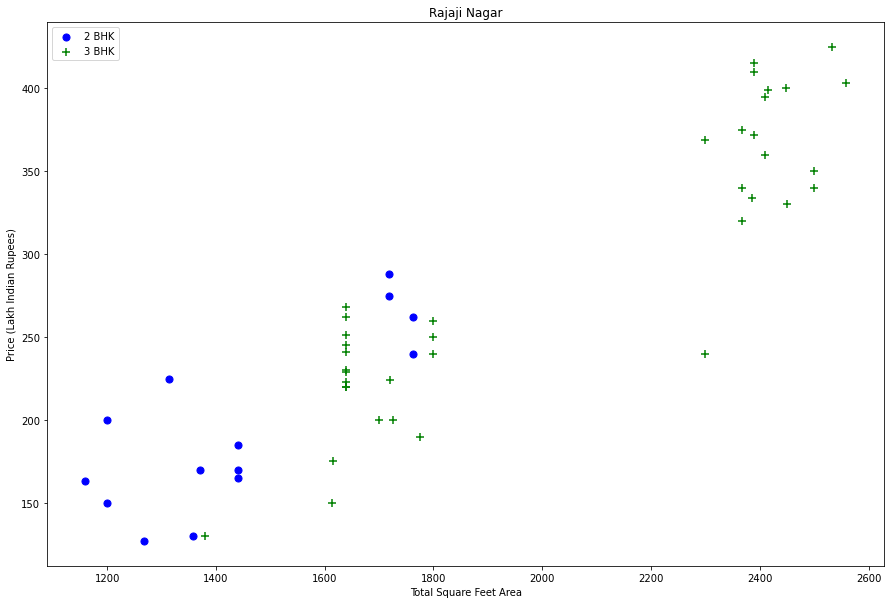
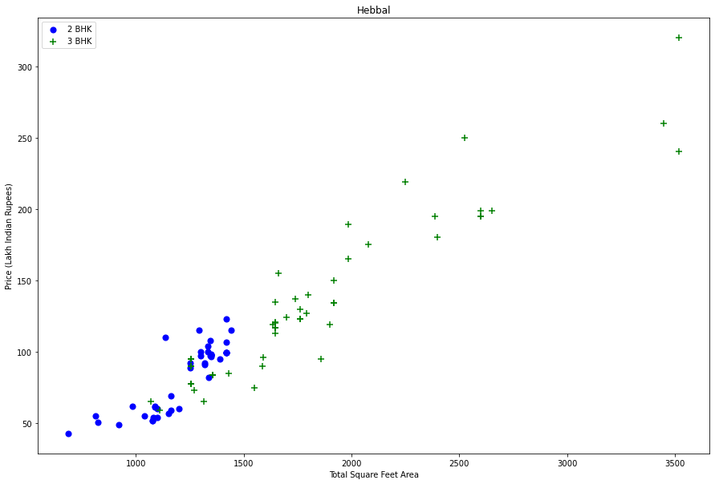
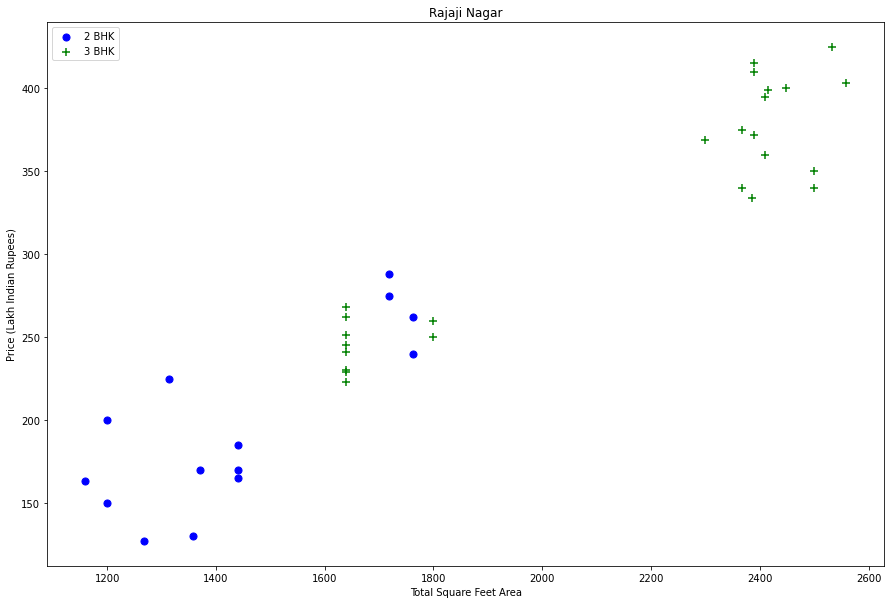
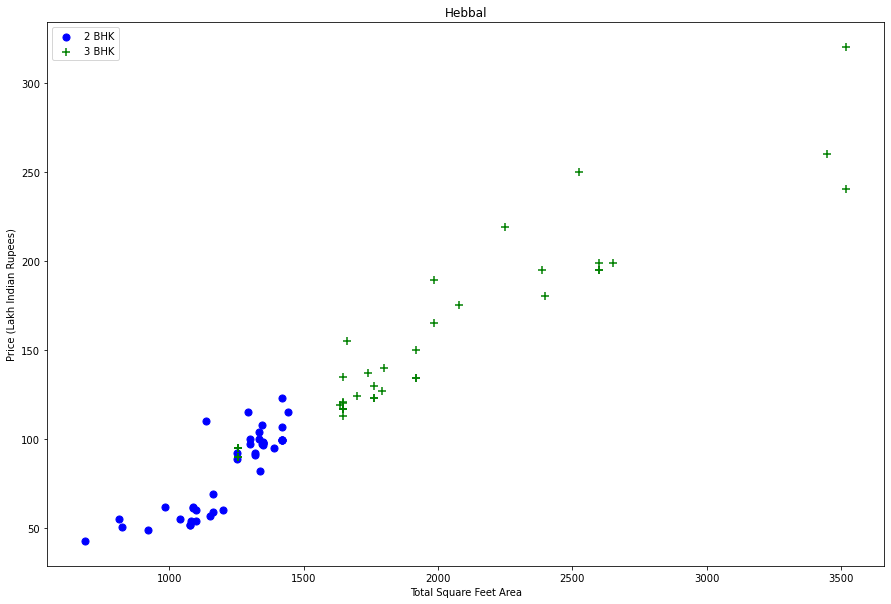
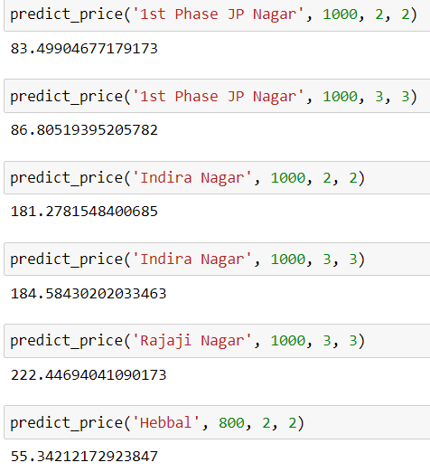

# Machine-Learning-Real-Estate-Price-Prediction
A real estate price prediction model built in Python with Jupyter Notebook

This project focuses on building a real estate price prediction model using sklearn and linear regression using bangalore home prices dataset from kaggle.com. The model building covers data science concepts like data loading, data cleaning, outlier detection and removal, feature engineering, dimensionality reduction, gridsearchcv for hyperparameter tuning, k fold cross validation. 

Technology used;
1. Python 
2. Numpy and Pandas for Data Cleaning
3. Matplotlib for Data visualisation
4. Sklearn for model building
5. Jupyter notebook as IDE

During data cleaning and outlier removal we found out the some of the 2BHK house prices are more than 3BHK houses with similar area.

There are some properties where for the same location, the price of 3 bedroom apartment is less than 2 bedroom apartment and they also have the same square feet area, we will build a dictionary for a given location of stats per bhk i.e

{ '1' : { 'mean' : 4000, 'std' : 2000,' 'count' : 34 },

'2' : { 'mean' ; 4300, 'std' : 2300, 'count' : 22 }, }

Now we can remove those 2 BHK apartments whose price_per_sqft is less than mean price_per_sqft of 1 BHK apartment

After building dividing the dataset into train and test and building a linear regression, lasso and decision tree models we found the best model is Linear Regression Model using gridsearch cv and deployed it.

Predictions: 

Project credits - CodeBasics Youtube Channel.
